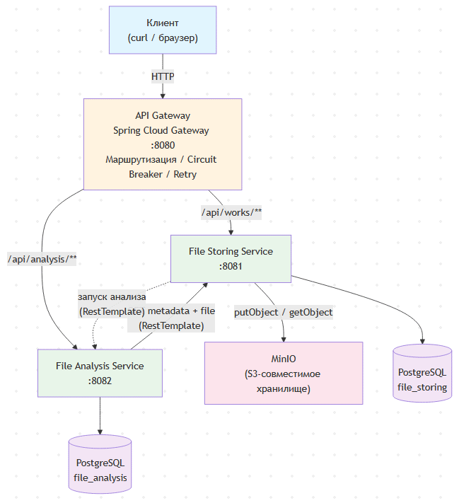

# Дoмaшнее зaдaние № 4 по Сиcтeмнoму дизaйнy

Скринкаст: https://disk.yandex.ru/d/vaGndkwOiuyHCw

## 1. Описание проделанной работы

Разработана информационная система для загрузки, хранения и анализа студенческих работ. 
Система реализована по микросервисной архитектуре и состоит из трёх сервисов, каждый из которых решает свою узкую задачу и 2 - собственное хранилище данных.


### Компоненты системы

**File Storing Service** (`file-storing-service`)
- Принимает загруженные файлы через multipart/form-data
- Сохраняет файлы в MinIO (S3-совместимое объектное хранилище)
- Сохраняет метаданные о файлах в собственную БД PostgreSQL
- Предоставляет скачивание файлов по ID работы
- После успешной загрузки инициирует анализ через File Analysis Service
- Ограничивает размер загружаемого файла на уровне сервлета (до 100 MB, технический лимит)

**File Analysis Service** (`file-analysis-service`)
- Проверяет расширение файла (только pdf, docx, txt)
- Проверяет размер файла (до 1 MB)
- Создаёт отчёт о проверке со статусом «принято» или «требуется доработка»
- Сохраняет отчёты в собственную БД PostgreSQL
- При повторном запросе возвращает имеющийся отчёт из БД
- При отсутствии отчёта самостоятельно получает данные из File Storing Service

**API Gateway** (`api-gateway`)
- Единая точка входа для всех клиентов (порт 8080)
- Маршрутизирует запросы к соответствующим микросервисам
- Реализует Circuit Breaker + Retry (Resilience4j) для повышения отказоустойчивости
- Агрегирует Swagger UI обоих сервисов
- Обрабатывает ошибки с возвратом единого формата ответа


### Технологии

**Язык:** Java 17  
**Фреймворк:** Spring Boot 3.5.x  
**API Gateway:** Spring Cloud Gateway (WebFlux, Netty)  
**БД:** PostgreSQL 16 (Alpine)  
**Хранилище файлов:** MinIO (S3-совместимое)  
**ORM:** Spring Data JPA + Hibernate  
**Миграции БД:** Flyway  
**Документация API:** SpringDoc OpenAPI 2.8.x (Swagger)  
**Отказоустойчивость:** Resilience4j (Circuit Breaker + Retry)  
**Сборка:** Gradle (Kotlin DSL, многомодульный)  
**Контейнеризация:** Docker + Docker Compose  
**Тестирование:** JUnit 5 + Mockito + MockWebServer + Jacoco  
**Утилиты:** Lombok, SLF4J

## 2. Пользовательские сценарии

### Сценарий 1: Загрузка файла и запуск анализа
**Цель:** Пользователь загружает файл студенческой работы, система сохраняет его и запускает проверку.

**Последовательность:**
- Запрос: `POST /api/works` с файлом в теле (multipart/form-data)
- Технический лимит на уровне сервлета (max-file-size: 100MB, max-request-size: 110MB)
- Сохранение файла в MinIO в bucket `student-works`
- Сохранение метаданных в таблицу `works`
- Синхронный вызов `GET /api/analysis/works/{id}/report` для запуска анализа
- Если анализ падает с ошибкой — это не блокирует загрузку (ошибка логируется)
- Ответ: `201 Created` с метаданными загруженной работы

### Сценарий 2: Получение отчёта (из кэша)
**Цель:** Пользователь запрашивает отчёт, который уже был создан ранее.

**Последовательность:**
- Запрос: `GET /api/analysis/works/{workId}/report`
- Сервис ищет запись в таблице `analysis_reports` по `work_id`
- Если отчёт найден — возвращается без обращения к File Storing Service
- Ответ: `200 OK` с полными данными отчёта (статус, имя файла, размер, формат, заметки)

### Сценарий 3: Получение отчёта (первый запрос, анализ с нуля)
**Цель:** Пользователь запрашивает отчёт, которого ещё нет в БД. Система самостоятельно получает данные из File Storing Service, проводит анализ и возвращает результат.

**Последовательность:**
- При отсутствии отчёта сервис последовательно вызывает:
 1. `GET /api/works/{id}` — получение метаданных (имя файла, студент)
 2. `GET /api/works/{id}/file` — скачивание файла для проверки
- Если File Storing Service возвращает 404 на любом из шагов — клиент получает `404 Not Found`
- Если файл недоступен (IOException) — клиент получает `500 Internal Server Error`
- Анализ проверяет расширение и размер, формирует отчёт, сохраняет в БД
- Ответ: `200 OK` со свежесозданным отчётом

### Сценарий 4: Скачивание файла
**Цель:** Пользователь скачивает ранее загруженный файл.

**Последовательность:**
- Запрос: `GET /api/works/{id}/file`
- Файл извлекается из MinIO по сохранённому S3-ключу
- Ответ: `200 OK` с Content-Type из БД (application/pdf, и т.д.)

### Сценарий 5: Обработка ошибок и Circuit Breaker
**Цель:** При недоступности микросервиса Gateway автоматически повторяет запрос и, при неудаче, возвращает корректный ответ об ошибке без падения всей системы.

**Последовательность:**
- Resilience4j Circuit Breaker: 3 попытки, окно 10 вызовов, порог отказа 50%
- Retry: 3 попытки для статусов 502 Bad Gateway и 503 Service Unavailable
- Fallback возвращает `503 Service Unavailable` с информацией о недоступности сервиса
- Timeout: 5 секунд на запрос


## 3. Схема взаимодействия сервисов

**HTTP-вызовы между микросервисами**

File Storing Service → File Analysis Service: GET `/api/analysis/works/{workId}/report` — запуск анализа после загрузки файла.

File Analysis Service → File Storing Service: GET `/api/works/{workId}` — получение метаданных работы.

File Analysis Service → File Storing Service: GET `/api/works/{workId}/file` — скачивание файла для проверки.

**Маршруты API Gateway**

`/api/works/**` → File Storing Service (порт 8081), фильтры: CircuitBreaker + Retry (Docker).

`/api/analysis/**` → File Analysis Service (порт 8082), фильтры: CircuitBreaker + Retry (Docker).

`/file-storing-service/v3/api-docs` → File Storing Service (порт 8081), фильтр: RewritePath.

`/file-analysis-service/v3/api-docs` → File Analysis Service (порт 8082), фильтр: RewritePath.


Вот отформатированный текст без таблиц:

## 4. API-эндпоинты

**File Storing Service** (через Gateway: `http://localhost:8080`)

`POST /api/works` — загрузка файла (multipart/form-data). Коды ответов: 201, 400, 413, 500.

`GET /api/works/{id}` — метаданные работы. Коды ответов: 200, 404.

`GET /api/works/{id}/file` — скачивание файла. Коды ответов: 200, 404.

`GET /api/works/by-student?name=` — поиск по имени студента. Код ответа: 200.

**File Analysis Service** (через Gateway: `http://localhost:8080`)

`GET /api/analysis/works/{workId}/report` — получение отчёта. Коды ответов: 200, 400, 404, 500.


## 5. Запуск системы

**Через Docker Compose**

Сборка всех сервисов (я делал также через интерфейс IDE):
```bash
./gradlew build
```

Запуск  (я делал также через интерфейс IDE):
```bash
docker compose up -d
```

Просмотр логов  (я делал также через интерфейс IDE):
```bash
docker compose logs -f
```

**Порты**

API Gateway: внутренний порт 8080, внешний порт 8080 (из .env).

File Storing Service: внутренний порт 8081, внешний порт 8081 (из .env).

File Analysis Service: внутренний порт 8082, внешний порт 8082 (из .env).

MinIO API: внутренний порт 9000, внешний порт 9000 (из .env).

MinIO Console: внутренний порт 9001, внешний порт 9001 (из .env).

Пример файла .env в репозитории - .env.example

**Swagger UI**

После запуска доступен по адресу: `http://localhost:8080/swagger-ui.html`

**Примеры запросов**

Загрузка файла:
```bash
curl -X POST http://localhost:8080/api/works \
  -F "file=@test.txt" \
  -F "studentName=Иванов"
```

Получение метаданных:
```bash
curl http://localhost:8080/api/works/1
```

Скачивание файла:
```bash
curl -o downloaded.pdf http://localhost:8080/api/works/1/file
```

Получение отчёта анализа:
```bash
curl http://localhost:8080/api/analysis/works/1/report
```
